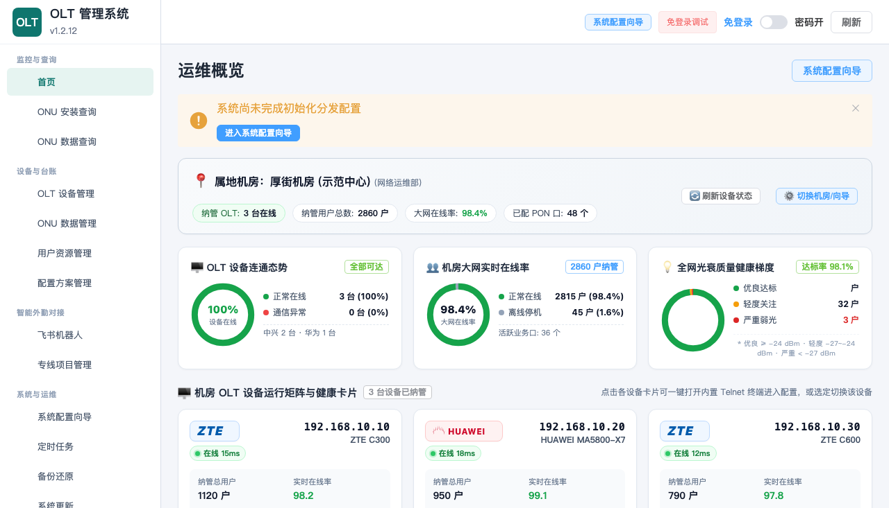
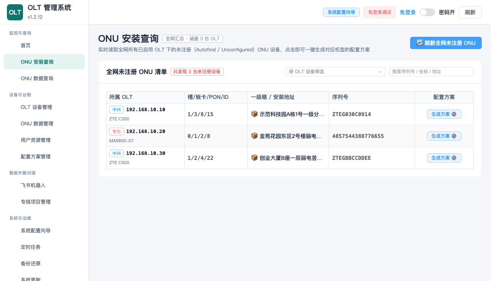
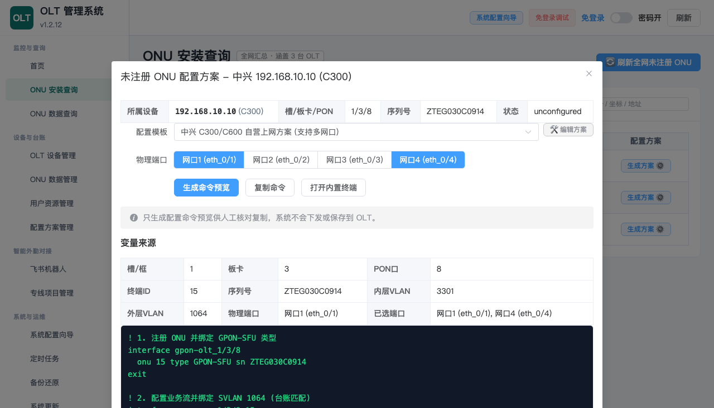

# 🚀 OLT Manager

**OLT Manager** 是一款专为一线装维工程师与机房维护人员打造的 **开箱即用型 GPON OLT 智慧运维助手**。支持中兴（ZTE C300/C320/C600）与华为（Huawei MA5800 系列）主流设备，彻底告别复杂的黑底命令行与繁琐易错的手动配置。

---

## 🌟 核心价值：解决现场什么痛点？

- **自动扫猫，不再等报工单**：在全网未注册大盘中一键实时探查已插纤上电的未注册光猫（Autofind / Unconfigured），新猫上线秒级感知。
- **物理地址精准匹配**：结合本地导入的 PON 台账，自动将未注册光猫所在的槽/板/PON 端口对应到具体的一级分纤箱、小区与楼栋门牌。
- **智能方案，多网口单规则搞定**：告别重复书写 4 遍端口命令！只需一条单规则模版，系统根据勾选的网口（如 1口、全开）智能逐行展开配置脚本。模板编辑器还支持**右键直接插入变量**。
- **全网健康大盘一目了然**：设备在线态势、大网光猫在线率、光衰质量健康阶梯梯度全景展现，弱光隐患一眼洞察。

---

## 🛡️ 铁律级安全红线：100% 只读探查，绝不私自改动设备

机房运行安全重于泰山，OLT Manager 从设计之初就确立了不可动摇的安全边界：

1. **只读数据采集**：所有设备信息、在线状态、光衰指标均采用 SNMP v2c 只读命令（`get`/`walk`）与固定白名单只读 `show` 指令获取。
2. **严禁自动写配置**：系统**绝不支持** `snmpset`、**绝不自动注册/注销光猫**、**绝不重启光猫**、**绝不自动保存 OLT 设备配置**。
3. **命令预览，人工确认**：所有开通配置均以文本预览形式呈现，支持一键调出内置安全 Telnet 终端登录设备，由工程师人工核对无误后手动粘贴执行。

---

## 📸 系统界面概览

### 1. 机房 OLT 运行态势与健康大盘
全景呈现机房多台 OLT 设备连通状态、在线率统计、全网光衰质量健康梯度分布，以及直观的设备卡片矩阵。


---

### 2. 全网未注册 ONU 聚合发现与地址匹配
一键跨厂商多台 OLT 聚合扫描未配置设备，自动关联本地台账中的一级分纤箱物理地址，支持序列号一键快捷复制。


---

### 3. 智能配置方案引擎（单规则逐行展开与纯净变量）
自动计算候选 ONU ID 与业务 VLAN，支持 1~4 网口灵活多选，配置脚本智能逐行展开，纯净变量清晰溯源，支持复制并直通内置安全终端。


---

## 💻 快速安装与升级

系统提供开箱即用的桌面发行版本，无需繁琐的环境配置：

### 🪟 Windows 11 免安装版（即开即用）
- **下载与启动**：从 GitHub Release 下载最新的 `OLT.Manager-*-win.zip`，解压到任意文件夹，双击运行 `OLT Manager.exe` 即可使用。
- **零依赖运行**：压缩包内已完整打包 SQLite 运行环境与内置 Node SNMP / Telnet 客户端，**不需要**在电脑上手动安装 Node.js、Python 或任何数据库工具，也无需设置环境变量。

### 🍎 macOS 版（Apple Silicon）
- **下载与安装**：下载最新的 `OLT.Manager-*-arm64.dmg`，双击打开并将 `OLT Manager.app` 拖入系统的“应用程序”文件夹。
- **首次打开提示“已损坏，无法打开”的解决办法**：
  > 由于本工具为内部发布版本，未向苹果官方购买高额的商业公证证书，macOS Gatekeeper 安全机制会默认添加隔离标记并提示已损坏。
  1. 打开 macOS 自带的「终端」（Terminal）；
  2. 复制并执行以下单行命令解除隔离：
     ```bash
     xattr -dr com.apple.quarantine "/Applications/OLT Manager.app"
     ```
  3. 执行完毕后即可像普通软件一样正常双击打开运行。
- *推荐工具*：macOS 现场若需增强 SNMP 采集，建议通过 Homebrew 安装 `net-snmp`（`brew install net-snmp`）。

### ⚡ 秒级增量升级（无需重复下载大包）
日常版本迭代无需重新下载几百兆的完整客户端包：
1. 从 Release 中下载对应版本的更新补丁包（如 `patch-v1.2.11-to-v1.2.12.zip`）；
2. 打开系统左侧边栏的「系统更新」页面；
3. 上传增量补丁包，系统自动校验并瞬间完成热更新；
4. 现场数据库、导入的 PON 台账与设备凭据完全保留，安全无损。

---

## 🧭 新手上路与配置指南

使用 OLT Manager 仅需简单的四个步骤即可完成首次开局：

### 第一步：进入系统配置向导
首次打开系统或点击左侧「系统配置向导」，根据提示快速配置：
- 设定属地机房名称（如“厚街机房”）与所属网络运维组织；
- 确认本地管理安全密码。

### 第二步：添加与校验 OLT 设备
1. 点击左侧「OLT 设备管理」，点击「新增 OLT 设备」；
2. 输入设备名称、厂商类型（中兴 ZTE / 华为 Huawei）、设备型号、IP 地址；
3. 输入只读 **SNMP Community**（团体名）以及用于终端登录的 Telnet 账号密码；
4. 点击「测试连通性」，系统会即时验证 SNMP 只读通信与设备响应耗时。

### 第三步：导入本地 PON 台账
1. 点击左侧「ONU 数据管理」，支持下载标准 Excel 台账模板；
2. 将现场维护的机房台账（包含框、槽/板卡、PON口、一级分纤箱名称、外层业务 VLAN 等信息）直接一键导入；
3. 导入后本地 SQLite 会安全持久化存储，后续扫描未注册光猫时系统将全自动匹配物理地址。

### 第四步：极速开通未注册光猫
1. 装维人员在现场将光猫插纤上电；
2. 在系统点击左侧「ONU 安装查询」，点击「刷新全网未注册 ONU」；
3. 列表中实时出现该光猫，物理坐标与所属一级箱地址清晰呈现；
4. 点击「生成方案」，选择开通模板（如“中兴自营上网”），勾选需要的网口（如 1口 或 4口全开）；
5. 脚本自动智能展开，点击「复制命令」或「打开内置终端」进入配置模式，人工粘贴回车确认即可完成上线！

---

## 🛠️ 配置方案模板定制指南

系统内置了标准的中兴、华为开通方案模板，您也可以在「配置方案管理」中根据本地机房规范自由定制：

- **单规则智能多端口展开**：
  在模板中只需编写包含 `{{ethPort}}` 的单行规则，例如：
  ```text
  vlan port {{ethPort}} mode hybrid def-vlan {{innerVlan}}
  ```
  当在开通弹窗勾选多个网口时，系统会自动将该规则逐行展开为每个选中的端口，无需重复手写 4 条！
- **右键随选变量插入**：
  在模板编辑器中，**鼠标右键**即可弹出可用的变量列表（如槽位 `{{chassis}}`、板卡 `{{board}}`、PON口 `{{pon}}`、终端ID `{{onuId}}`、序列号 `{{serial}}`、外层VLAN `{{outerVlan}}`、物理端口 `{{ethPort}}` 等），点击即可自动插入到光标所在处。

---

## 💻 源码开发与测试

如需进行二次开发、调试或本地测试：

```bash
# 1. 安装项目依赖（使用项目内置 pnpm store）
pnpm install

# 2. 运行自动化测试套件
pnpm test

# 3. 语法与逻辑检查
node --check src/server.mjs
node --check src/db.mjs
node --check src/zte-telnet.mjs

# 4. 启动前端 Vite 热更新开发服务
pnpm dev

# 5. 构建生产包与启动本地服务
pnpm build
pnpm start

# 6. 本地启动 Electron 桌面版测试
pnpm run desktop
```

---

## 🔒 隐私与安全承诺

- **无隐私数据泄露**：真实 OLT IP、SNMP 密码、Telnet 凭据以及导入的现场台账均只保存在用户本机目录的 SQLite 数据库中，绝不上传任何云端服务器。
- **开源合规**：版本发布与代码提交均严格遵守脱敏要求，演示用例全量使用虚拟示范数据。
