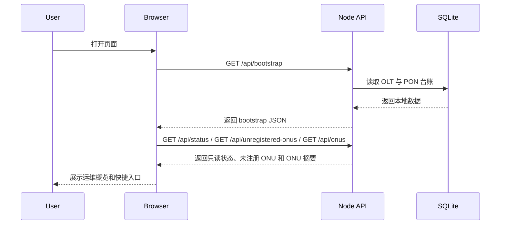
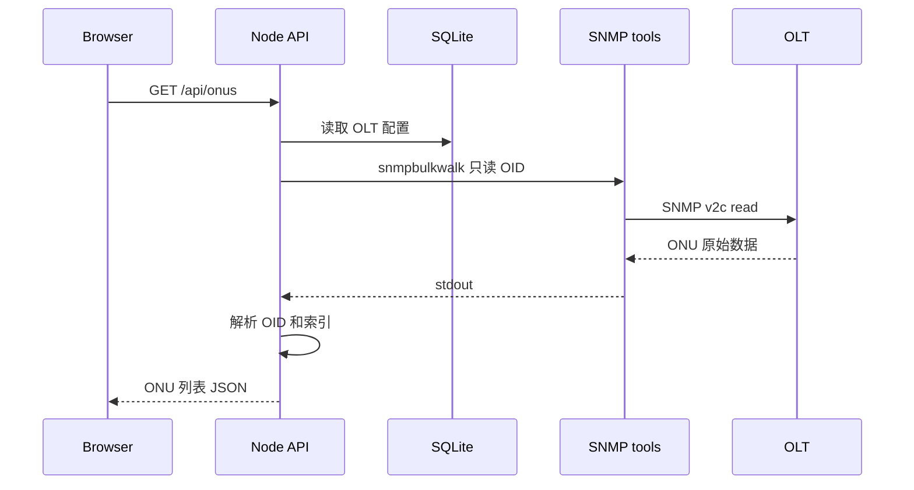
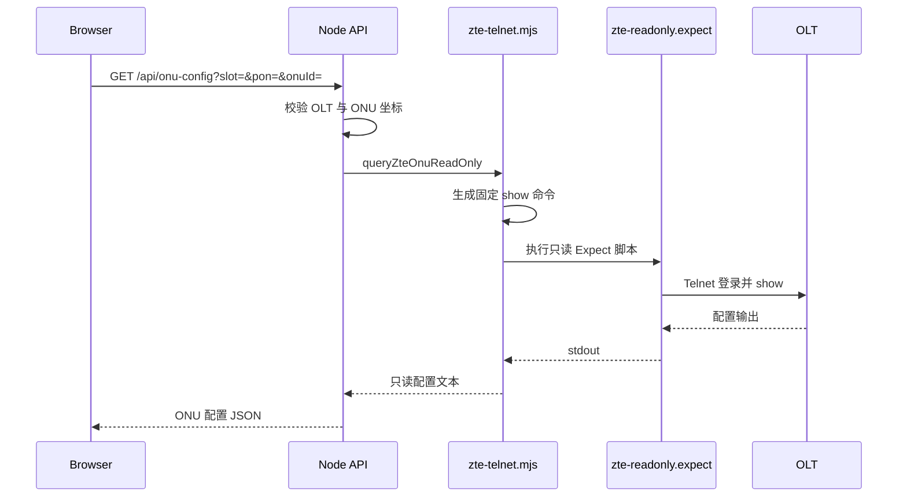
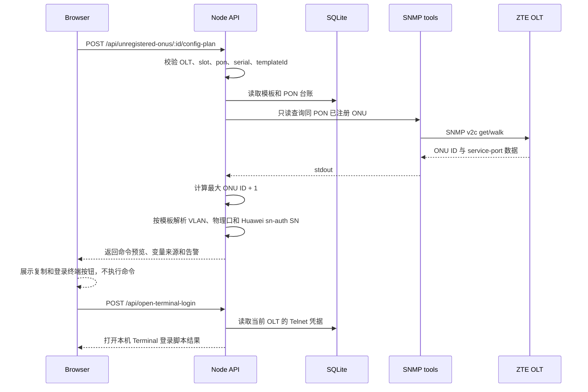
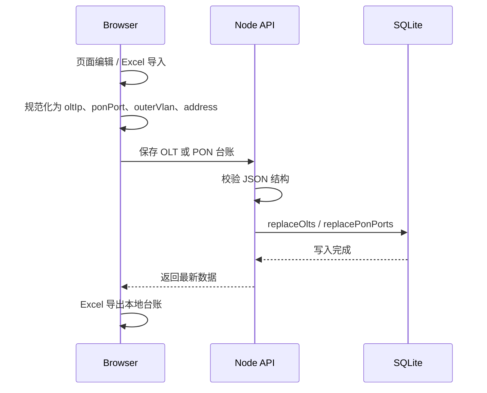
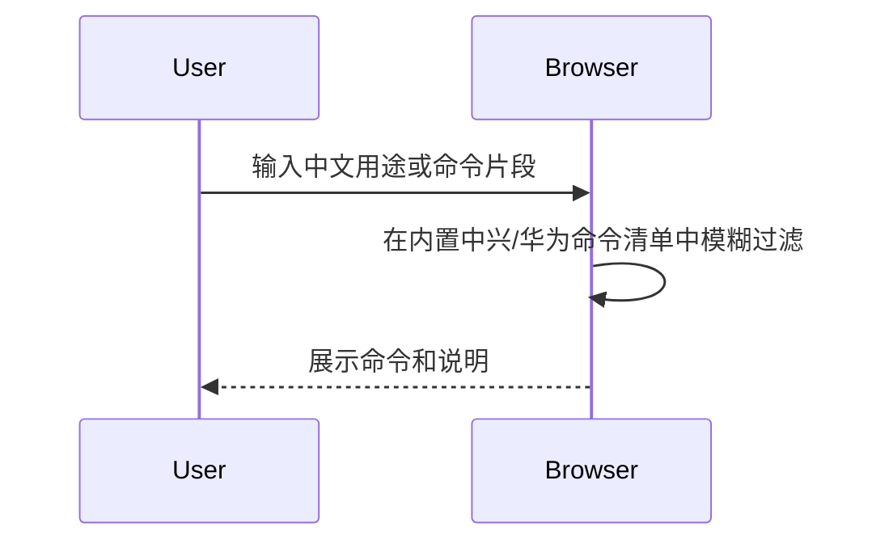

# Sequence Design

本文件描述关键流程，便于后续拆分测试和定位回归。

## 启动流程

## ONU 查询流程

## ZTE ONU 配置只读查询

## 未注册 ONU 配置方案生成

规则：

- ONU ID 不复用空洞；同 PON 最大 ONU ID 达到 `128` 时阻止生成。
- 自营上网和内部网络主要使用固定 VLAN 和用户选择的物理口。
- MDU+OTT 从同 PON 已配置样板 ONU 的 service-port 表读取内层 VLAN、外层 VLAN 和互动 VLAN。
- Huawei 自营上网使用固定内层 VLAN `3301`、line/service profile `300`、gemport `0`，并把可读 SN 转换为原始十六进制 SN。
- 未注册 ONU 自身没有 service-port，不能直接读取业务 VLAN。
- 打开终端流程不传递命令文本；ZTE 自动 `con t`，Huawei 自动 `enable` + `config`，命令仍由用户人工粘贴和确认。

## 管理台账流程

管理台账是本地应用数据写入，不是 OLT 设备写入。Excel 导入导出均在浏览器和本地 API 之间完成，不登录 OLT、不执行 SNMP/Telnet 写操作。

## 常用命令检索流程

常用命令检索在独立页面展示命令文本，不能自动登录、自动粘贴或自动执行。
