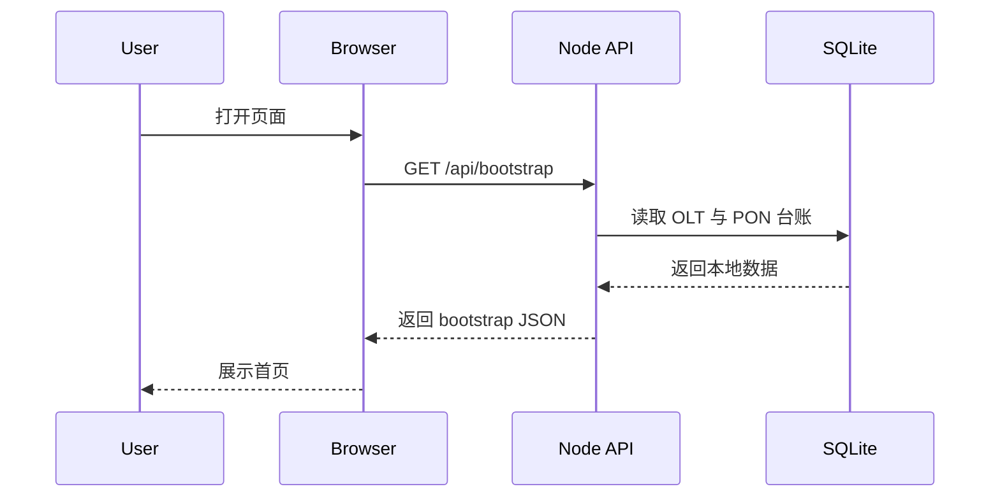
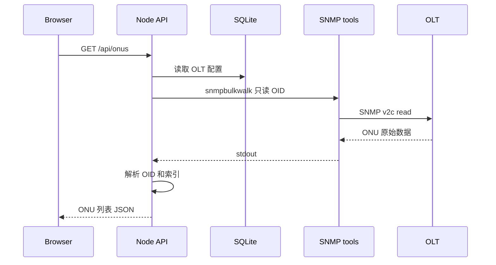
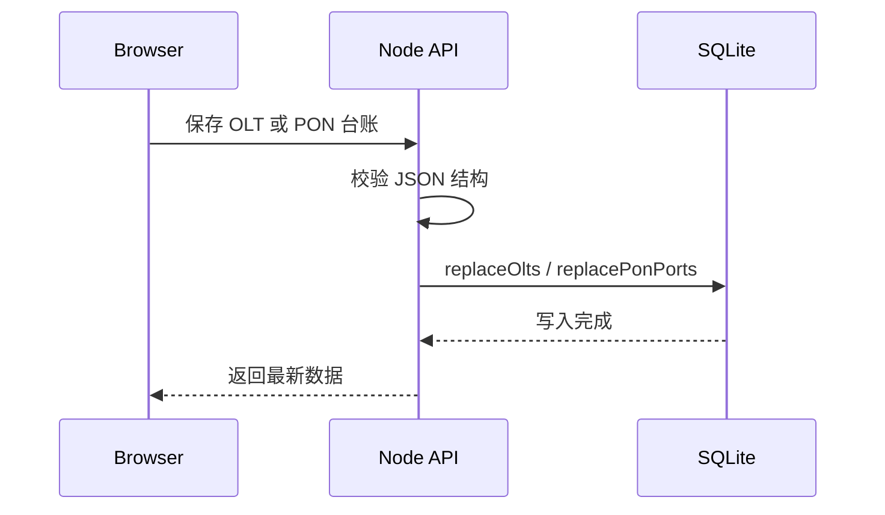

# Sequence Design

本文件描述关键流程，便于后续拆分测试和定位回归。

## 启动流程

```mermaid
sequenceDiagram
  participant User as User
  participant Browser as Browser
  participant API as Node API
  participant DB as SQLite

  User->>Browser: 打开页面
  Browser->>API: GET /api/bootstrap
  API->>DB: 读取 OLT 与 PON 台账
  DB-->>API: 返回本地数据
  API-->>Browser: 返回 bootstrap JSON
  Browser-->>User: 展示首页
```

## ONU 查询流程

```mermaid
sequenceDiagram
  participant Browser as Browser
  participant API as Node API
  participant DB as SQLite
  participant SNMP as SNMP tools
  participant OLT as OLT

  Browser->>API: GET /api/onus
  API->>DB: 读取 OLT 配置
  API->>SNMP: snmpbulkwalk 只读 OID
  SNMP->>OLT: SNMP v2c read
  OLT-->>SNMP: ONU 原始数据
  SNMP-->>API: stdout
  API->>API: 解析 OID 和索引
  API-->>Browser: ONU 列表 JSON
```

## ZTE ONU 配置只读查询

```mermaid
sequenceDiagram
  participant Browser as Browser
  participant API as Node API
  participant Adapter as zte-telnet.mjs
  participant Expect as zte-readonly.expect
  participant OLT as ZTE OLT

  Browser->>API: GET /api/onu-config?slot=&pon=&onuId=
  API->>API: 校验 OLT 与 ONU 坐标
  API->>Adapter: queryZteOnuReadOnly
  Adapter->>Adapter: 生成固定 show 命令
  Adapter->>Expect: 执行只读 Expect 脚本
  Expect->>OLT: Telnet 登录并 show
  OLT-->>Expect: 配置输出
  Expect-->>Adapter: stdout
  Adapter-->>API: 只读配置文本
  API-->>Browser: ONU 配置 JSON
```

## 管理台账流程

```mermaid
sequenceDiagram
  participant Browser as Browser
  participant API as Node API
  participant DB as SQLite

  Browser->>API: 保存 OLT 或 PON 台账
  API->>API: 校验 JSON 结构
  API->>DB: replaceOlts / replacePonPorts
  DB-->>API: 写入完成
  API-->>Browser: 返回最新数据
```

管理台账是本地应用数据写入，不是 OLT 设备写入。
