# Sequence Design

本文件描述关键流程，便于后续拆分测试和定位回归。

## OLT Manager 内置 Feishu 只读查询

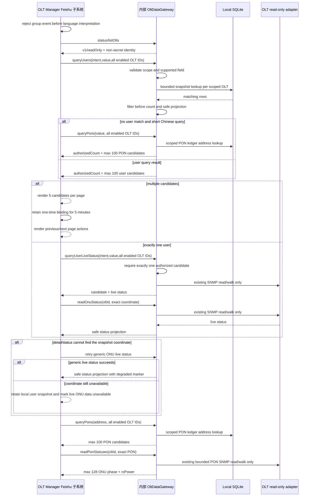
```mermaid
sequenceDiagram
  participant Feishu as OLT Manager Feishu 子系统
  participant Gateway as 内部 OltDataGateway
  participant DB as Local SQLite
  participant OLT as OLT read-only adapter
  Feishu->>Feishu: reject group event before language interpretation
  Feishu->>Gateway: status/listOlts
  Gateway-->>Feishu: v1/readOnly + non-secret identity
  Feishu->>Gateway: queryUsers(intent,value,all enabled OLT IDs)
  Gateway->>Gateway: validate scope and supported field
  Gateway->>DB: bounded snapshot lookup per scoped OLT
  DB-->>Gateway: matching rows
  Gateway->>Gateway: filter before count and safe projection
  alt no user match and short Chinese query
    Feishu->>Gateway: queryPons(value, all enabled OLT IDs)
    Gateway->>DB: scoped PON ledger address lookup
    Gateway-->>Feishu: authorizedCount + max 100 PON candidates
  else user query result
    Gateway-->>Feishu: authorizedCount + max 100 user candidates
  end
  alt multiple candidates
    Feishu-->>Feishu: render 5 candidates per page
    Feishu->>Feishu: retain one-time binding for 5 minutes
    Feishu-->>Feishu: render previous/next page actions
  else exactly one user
    Feishu->>Gateway: queryUserLiveStatus(intent,value,all enabled OLT IDs)
    Gateway->>Gateway: require exactly one authorized candidate
    Gateway->>OLT: existing SNMP read/walk only
    Gateway-->>Feishu: candidate + live status
    Feishu->>Gateway: readOnuStatus(oltId, exact coordinate)
    Gateway->>OLT: existing SNMP read/walk only
    OLT-->>Gateway: live status
    Gateway-->>Feishu: safe status projection
  end
  alt detail/status cannot find the snapshot coordinate
    Feishu->>Gateway: retry generic ONU live status
    alt generic live status succeeds
      Gateway-->>Feishu: safe status projection with degraded marker
    else coordinate still unavailable
      Feishu-->>Feishu: retain local user snapshot and mark live ONU data unavailable
    end
  end
  Feishu->>Gateway: queryPons(address, all enabled OLT IDs)
  Gateway->>DB: scoped PON ledger address lookup
  Gateway-->>Feishu: max 100 PON candidates
  Feishu->>Gateway: readPonStatuses(oltId, exact PON)
  Gateway->>OLT: existing bounded PON SNMP read/walk only
  Gateway-->>Feishu: max 128 ONU phase + rxPower
```

内部只读数据服务不触发 NMSE 同步，不执行 SNMP SET、任意设备命令或配置写入，也不通过 HTTP 对外暴露。

## 启动流程

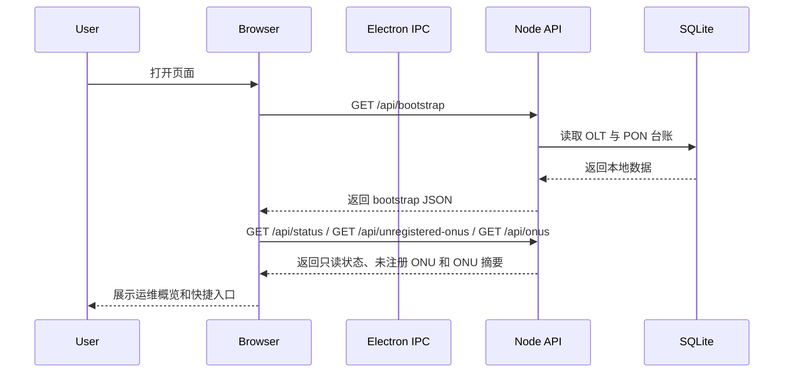
```mermaid
sequenceDiagram
  participant User as User
  participant Browser as Browser
  participant Electron as Electron IPC
  participant API as Node API
  participant DB as SQLite

  User->>Browser: 打开页面
  Browser->>API: GET /api/bootstrap
  API->>DB: 读取 OLT 与 PON 台账
  DB-->>API: 返回本地数据
  API-->>Browser: 返回 bootstrap JSON
  Browser->>API: GET /api/status / GET /api/unregistered-onus / GET /api/onus
  API-->>Browser: 返回只读状态、未注册 ONU 和 ONU 摘要
  Browser-->>User: 展示运维概览和快捷入口
```

## 桌面启动流程

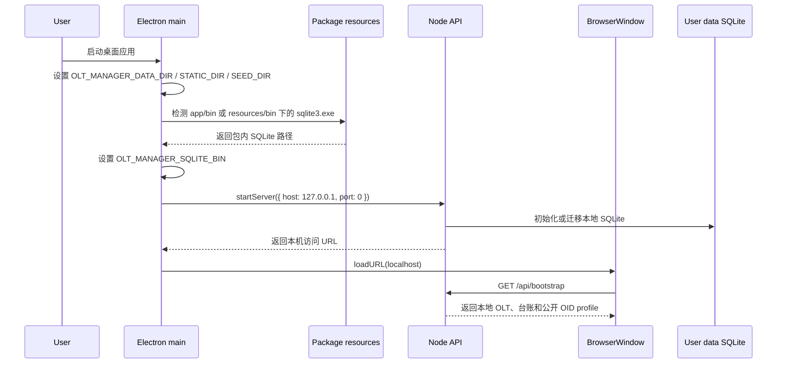
```mermaid
sequenceDiagram
  participant User as User
  participant Electron as Electron main
  participant FS as Package resources
  participant API as Node API
  participant Window as BrowserWindow
  participant DB as User data SQLite

  User->>Electron: 启动桌面应用
  Electron->>Electron: 设置 OLT_MANAGER_DATA_DIR / STATIC_DIR / SEED_DIR
  Electron->>FS: 检测 app/bin 或 resources/bin 下的 sqlite3.exe
  FS-->>Electron: 返回包内 SQLite 路径
  Electron->>Electron: 设置 OLT_MANAGER_SQLITE_BIN
  Electron->>API: startServer({ host: 127.0.0.1, port: 0 })
  API->>DB: 初始化或迁移本地 SQLite
  API-->>Electron: 返回本机访问 URL
  Electron->>Window: loadURL(localhost)
  Window->>API: GET /api/bootstrap
  API-->>Window: 返回本地 OLT、台账和公开 OID profile
```

桌面壳只负责启动本地服务和窗口，不增加设备写操作能力。运行数据写入用户数据目录，安装目录只放程序、脱敏 seed 和包内工具。Windows 7 安装版会自动绑定包内 SQLite CLI，不要求用户把 SQLite 加入 PATH。

## ONU 查询流程

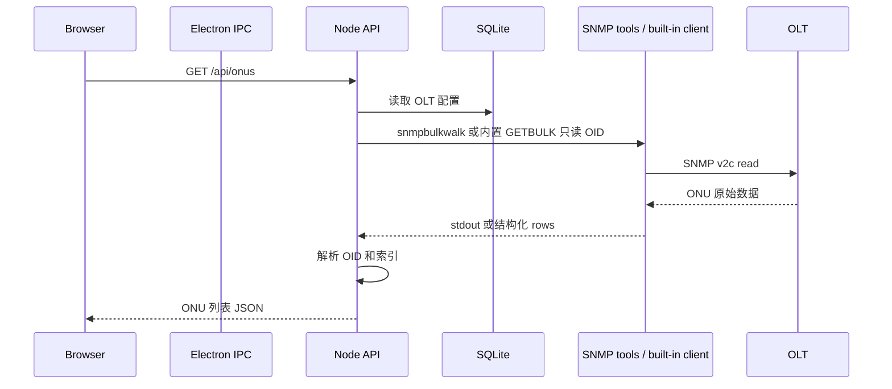
```mermaid
sequenceDiagram
  participant Browser as Browser
  participant Electron as Electron IPC
  participant API as Node API
  participant DB as SQLite
  participant SNMP as SNMP tools / built-in client
  participant OLT as OLT

  Browser->>API: GET /api/onus
  API->>DB: 读取 OLT 配置
  API->>SNMP: snmpbulkwalk 或内置 GETBULK 只读 OID
  SNMP->>OLT: SNMP v2c read
  OLT-->>SNMP: ONU 原始数据
  SNMP-->>API: stdout 或结构化 rows
  API->>API: 解析 OID 和索引
  API-->>Browser: ONU 列表 JSON
```

## ZTE ONU 配置只读查询

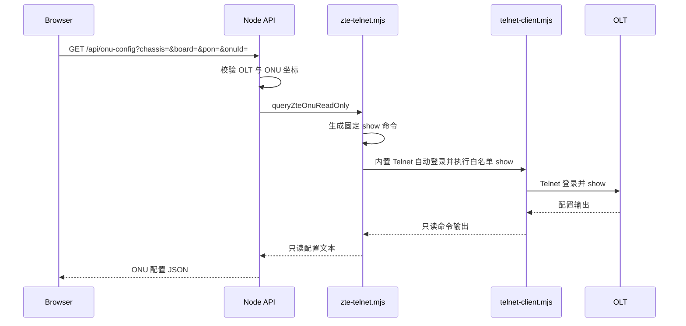
```mermaid
sequenceDiagram
  participant Browser as Browser
  participant API as Node API
  participant Adapter as zte-telnet.mjs
  participant Telnet as telnet-client.mjs
  participant OLT as OLT

  Browser->>API: GET /api/onu-config?chassis=&board=&pon=&onuId=
  API->>API: 校验 OLT 与 ONU 坐标
  API->>Adapter: queryZteOnuReadOnly
  Adapter->>Adapter: 生成固定 show 命令
  Adapter->>Telnet: 内置 Telnet 自动登录并执行白名单 show
  Telnet->>OLT: Telnet 登录并 show
  OLT-->>Telnet: 配置输出
  Telnet-->>Adapter: 只读命令输出
  Adapter-->>API: 只读配置文本
  API-->>Browser: ONU 配置 JSON
```

## 未注册 ONU 配置方案生成

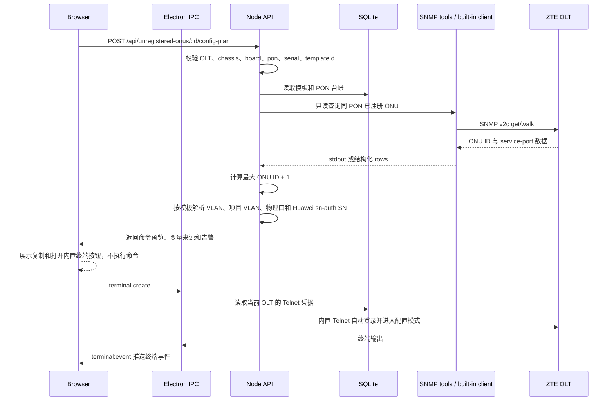
```mermaid
sequenceDiagram
  participant Browser as Browser
  participant Electron as Electron IPC
  participant API as Node API
  participant DB as SQLite
  participant SNMP as SNMP tools / built-in client
  participant OLT as ZTE OLT

  Browser->>API: POST /api/unregistered-onus/:id/config-plan
  API->>API: 校验 OLT、chassis、board、pon、serial、templateId
  API->>DB: 读取模板和 PON 台账
  API->>SNMP: 只读查询同 PON 已注册 ONU
  SNMP->>OLT: SNMP v2c get/walk
  OLT-->>SNMP: ONU ID 与 service-port 数据
  SNMP-->>API: stdout 或结构化 rows
  API->>API: 计算最大 ONU ID + 1
  API->>API: 按模板解析 VLAN、项目 VLAN、物理口和 Huawei sn-auth SN
  API-->>Browser: 返回命令预览、变量来源和告警
  Browser-->>Browser: 展示复制和打开内置终端按钮，不执行命令
  Browser->>Electron: terminal:create
  Electron->>DB: 读取当前 OLT 的 Telnet 凭据
  Electron->>OLT: 内置 Telnet 自动登录并进入配置模式
  OLT-->>Electron: 终端输出
  Electron-->>Browser: terminal:event 推送终端事件
```

规则：

- ONU ID 不复用空洞；同 PON 最大 ONU ID 达到 `128` 时阻止生成。
- 自营上网和内部网络主要使用固定 VLAN 和用户选择的物理口。
- ZTE 和 Huawei 自定义 VLAN 使用用户输入的业务 VLAN 和用户选择的物理口；缺少 VLAN 时不生成命令。
- ZTE 和 Huawei 项目模板由本地项目动态生成，展示项目名称和项目 VLAN，复用各自内部网络/自定义 VLAN 命令结构，把 VLAN 替换为项目 VLAN，不要求用户手动输入 VLAN。
- MDU+OTT 从同 PON 已配置样板 ONU 的 service-port 表读取内层 VLAN、外层 VLAN 和互动 VLAN。
- Huawei 自营上网使用固定内层 VLAN `3301`、line/service profile `300`、gemport `0`，为用户选择的 `eth1` 到 `eth4` 生成 `native-vlan`，并把可读 SN 转换为原始十六进制 SN。
- Huawei 内部网络使用固定 VLAN `100`、line/service profile `300`、gemport `0`，为用户选择的 `eth1` 到 `eth4` 生成 `native-vlan ... priority 0`，并生成 `service-port vlan 100`。
- Huawei 自定义 VLAN 复用内部网络命令结构，把固定 `100` 替换为用户输入的业务 VLAN，同时用于 `native-vlan`、`service-port vlan` 和 `user-vlan`。
- 坐标统一为 `槽/板卡/PON/ID`；ZTE 命令使用 `gpon-onu_<槽>/<板卡>/<PON>:<ONU ID>`，Huawei 板槽端口如 `0/1/0:1`。
- 未注册 ONU 自身没有 service-port，不能直接读取业务 VLAN。
- 打开内置终端流程不传递命令文本；ZTE 自动 `con t`，Huawei 自动 `enable` + `config`，命令仍由用户人工粘贴和确认。ZTE 配置方案预览不再包含 `configure terminal`，并在末尾增加两条只读 `show` 核查命令。
- 首页快捷入口的“打开终端”复用同一套 `terminal:create` IPC，只自动登录当前 OLT 并进入配置模式，不复制或传递任何配置方案文本。

## 项目管理流程

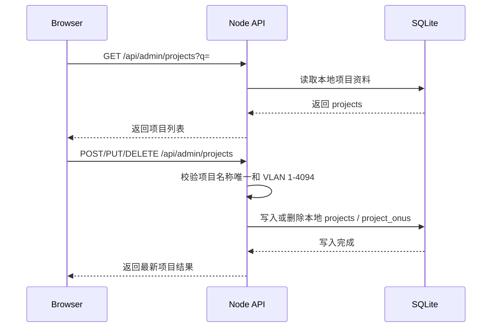
```mermaid
sequenceDiagram
  participant Browser as Browser
  participant API as Node API
  participant DB as SQLite

  Browser->>API: GET /api/admin/projects?q=
  API->>DB: 读取本地项目资料
  DB-->>API: 返回 projects
  API-->>Browser: 返回项目列表
  Browser->>API: POST/PUT/DELETE /api/admin/projects
  API->>API: 校验项目名称唯一和 VLAN 1-4094
  API->>DB: 写入或删除本地 projects / project_onus
  DB-->>API: 写入完成
  API-->>Browser: 返回最新项目结果
```

项目只用于本地资料、项目 VLAN 和后续项目模板。新建和编辑只写本地 SQLite，不绑定单台 OLT，不连接设备，不执行 SNMP 或 Telnet 命令。删除项目只删除本地项目和本地项目-ONU 关联，不删除本地 ONU 台账，不删除 OLT 实机 ONU，不执行 ONU 删除、重启或保存配置。

## ONU 加入项目流程

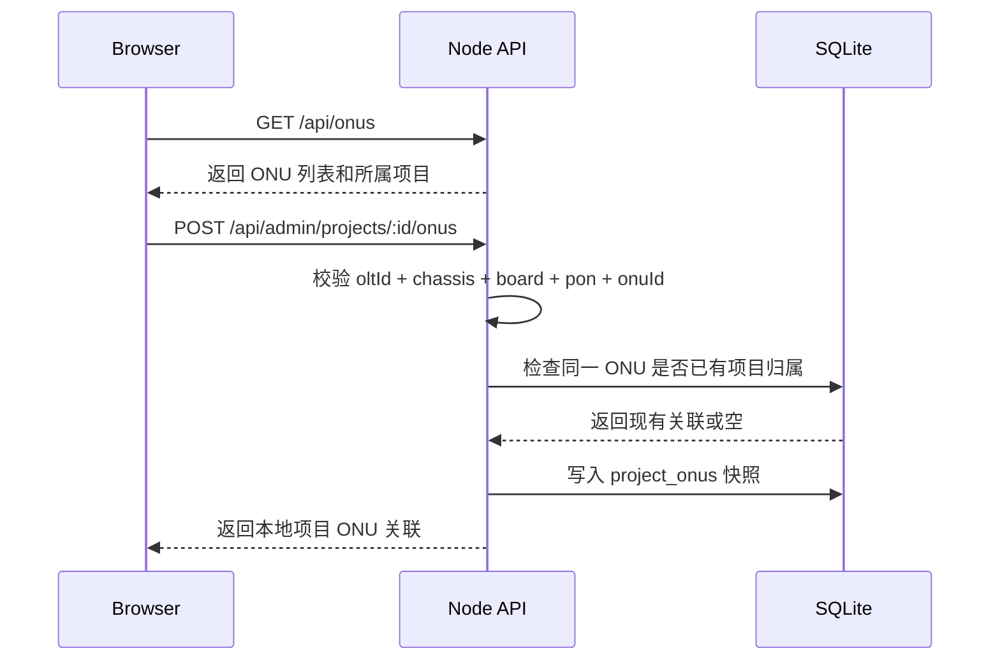
```mermaid
sequenceDiagram
  participant Browser as Browser
  participant API as Node API
  participant DB as SQLite

  Browser->>API: GET /api/onus
  API-->>Browser: 返回 ONU 列表和所属项目
  Browser->>API: POST /api/admin/projects/:id/onus
  API->>API: 校验 oltId + chassis + board + pon + onuId
  API->>DB: 检查同一 ONU 是否已有项目归属
  DB-->>API: 返回现有关联或空
  API->>DB: 写入 project_onus 快照
  API-->>Browser: 返回本地项目 ONU 关联
```

同一个 ONU 的唯一身份为 `oltId + chassis + board + pon + onuId`，只能属于一个项目。重复添加时返回明确错误，提示先从原项目移除；系统不自动转移项目归属。加入项目保存 SN、地址、VLAN 和备注快照，只写本地 SQLite，不删除本地 ONU 台账，不删除 OLT 实机 ONU，不执行设备写操作。

## 项目详情刷新流程

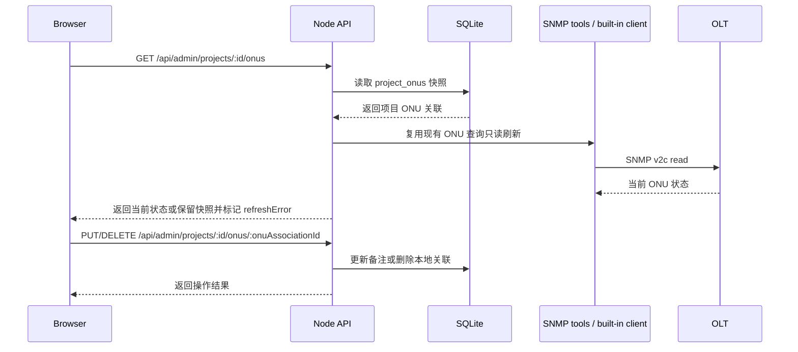
```mermaid
sequenceDiagram
  participant Browser as Browser
  participant API as Node API
  participant DB as SQLite
  participant SNMP as SNMP tools / built-in client
  participant OLT as OLT

  Browser->>API: GET /api/admin/projects/:id/onus
  API->>DB: 读取 project_onus 快照
  DB-->>API: 返回项目 ONU 关联
  API->>SNMP: 复用现有 ONU 查询只读刷新
  SNMP->>OLT: SNMP v2c read
  OLT-->>SNMP: 当前 ONU 状态
  API-->>Browser: 返回当前状态或保留快照并标记 refreshError
  Browser->>API: PUT/DELETE /api/admin/projects/:id/onus/:onuAssociationId
  API->>DB: 更新备注或删除本地关联
  API-->>Browser: 返回操作结果
```

项目详情尽量复用现有 ONU 查询逻辑刷新在线状态、光功率、距离和地址。读取失败或未找到当前 ONU 时，保留加入项目时保存的 SN、地址、VLAN 和备注快照，并返回 `refreshError`。备注编辑只更新 `project_onus.note`；移除项目 ONU 只删除本地关联，不删除本地 ONU 台账，不删除 OLT 实机 ONU，不执行任何配置命令。

## 管理台账流程

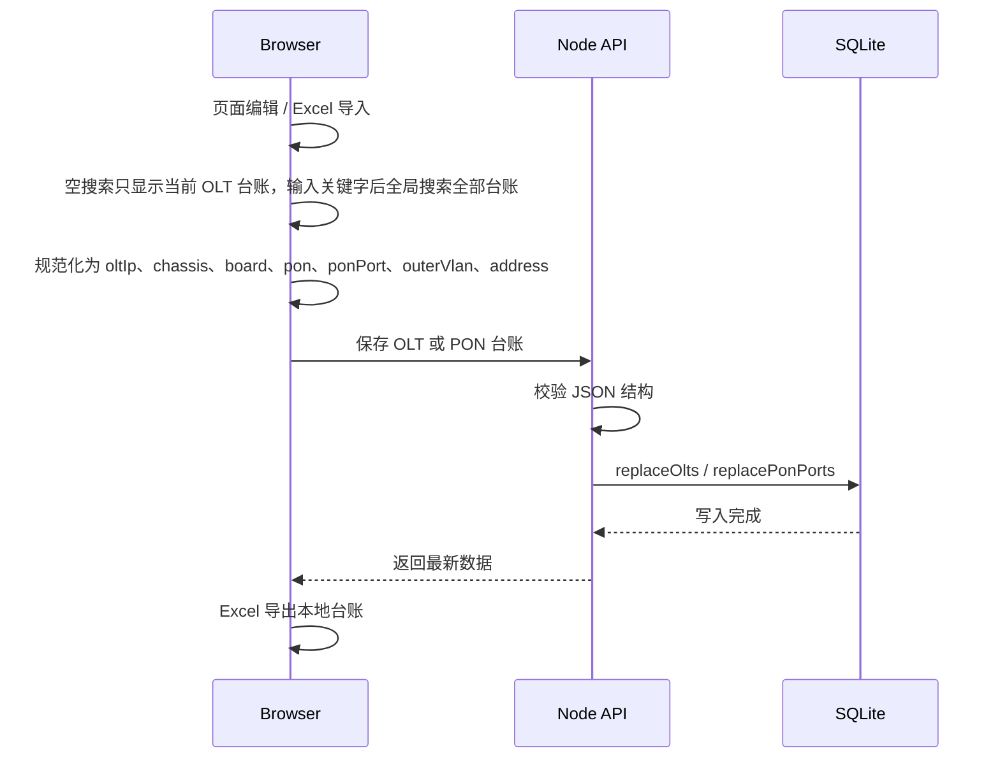
```mermaid
sequenceDiagram
  participant Browser as Browser
  participant API as Node API
  participant DB as SQLite

  Browser->>Browser: 页面编辑 / Excel 导入
  Browser->>Browser: 空搜索只显示当前 OLT 台账，输入关键字后全局搜索全部台账
  Browser->>Browser: 规范化为 oltIp、chassis、board、pon、ponPort、outerVlan、address
  Browser->>API: 保存 OLT 或 PON 台账
  API->>API: 校验 JSON 结构
  API->>DB: replaceOlts / replacePonPorts
  DB-->>API: 写入完成
  API-->>Browser: 返回最新数据
  Browser->>Browser: Excel 导出本地台账
```

管理台账是本地应用数据写入，不是 OLT 设备写入。ONU 数据管理列表空搜索时只渲染当前选择 OLT 的台账，避免大表卡顿；输入关键字后全局搜索全部台账，并优先展示当前 OLT 的匹配结果。Excel 导入导出均在浏览器和本地 API 之间完成，不登录 OLT、不执行 SNMP/Telnet 写操作。

SNMP 运行态外层 VLAN 刷新接口 `/api/admin/refresh-pon-vlans` 仍只针对当前选择 OLT 和 `oltIp`，用于兼容已有自动化调用。页面“ONU 数据管理”的“更新外层 VLAN”改为调用资源管理 NMSE SVLAN 同步，直接更新本地台账；不会执行 SNMP 写操作。

## 用户资源管理同步流程

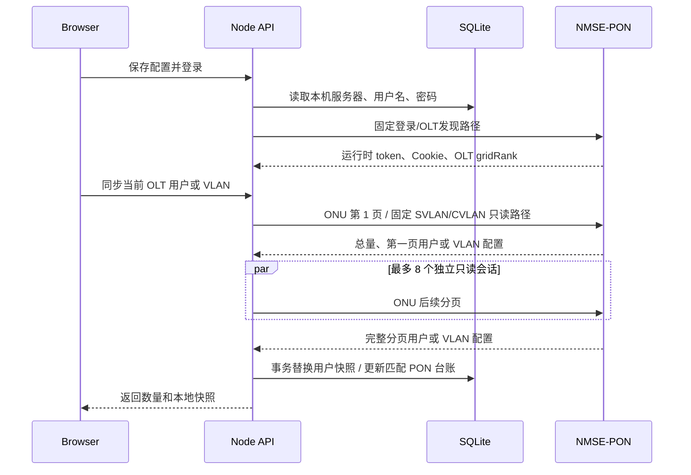
```mermaid
sequenceDiagram
  participant Browser as Browser
  participant API as Node API
  participant DB as SQLite
  participant NMSE as NMSE-PON

  Browser->>API: 保存配置并登录
  API->>DB: 读取本机服务器、用户名、密码
  API->>NMSE: 固定登录/OLT发现路径
  NMSE-->>API: 运行时 token、Cookie、OLT gridRank
  Browser->>API: 同步当前 OLT 用户或 VLAN
  API->>NMSE: ONU 第 1 页 / 固定 SVLAN/CVLAN 只读路径
  NMSE-->>API: 总量、第一页用户或 VLAN 配置
  par 最多 8 个独立只读会话
    API->>NMSE: ONU 后续分页
  end
  NMSE-->>API: 完整分页用户或 VLAN 配置
  API->>DB: 事务替换用户快照 / 更新匹配 PON 台账
  API-->>Browser: 返回数量和本地快照
```

token/Cookie 不写入 SQLite；考虑到现场服务端对 `pageSize=100` 可能首请求不响应，当前 NMSE ONU 分页固定使用兼容的 `pageSize=20`。用户同步第 1 页以 120 秒超时和 2 次临时失败重试确定总量，后续分页最多 8 路并发且每页有 45 秒超时和 1 次重试；任一页最终失败时不替换旧快照。NMSE SVLAN 是规划配置来源，SNMP VLAN 是设备运行态来源；SVLAN 同步后直接更新本地 PON 台账，用户资源管理页不重复展示 VLAN 配置。

定时任务提交 `operation` 和执行日期，不再选择 OLT。`operation` 可为 `network`（网管二期同步）、`nmse`（NMSE-PON同步）、`merge`（手动合并）或 `full`（全量同步），分别复用对应的现有只读流程。`repeatDays=0` 只执行一次；重复任务在同步成功或失败后都基于原计划时间增加指定天数，计算下一次未来执行时间并继续保持 `pending`。Node 进程启动时重新读取本地待执行任务并恢复计时器；所有远端操作仍只读，不写入 OLT。

任务列表可取消尚未执行的任务，也可永久删除非执行中的任务记录；删除只清理本机调度记录，不删除已经写入的用户快照。

## 统一合并 ONU 数据同步流程

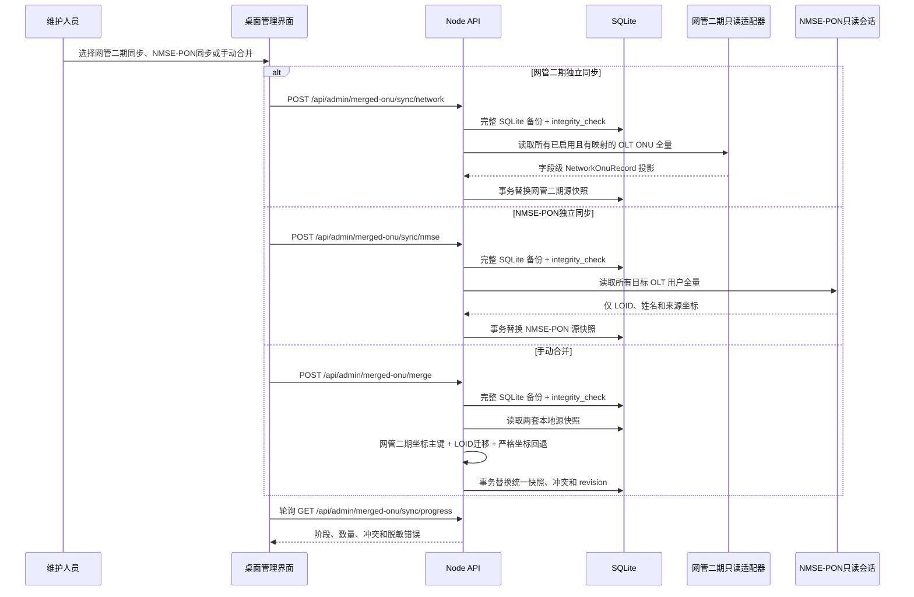
```mermaid
sequenceDiagram
  participant User as 维护人员
  participant Browser as 桌面管理界面
  participant API as Node API
  participant DB as SQLite
  participant NGB as 网管二期只读适配器
  participant NMSE as NMSE-PON只读会话

  User->>Browser: 选择网管二期同步、NMSE-PON同步或手动合并
  alt 网管二期独立同步
    Browser->>API: POST /api/admin/merged-onu/sync/network
    API->>DB: 完整 SQLite 备份 + integrity_check
    API->>NGB: 读取所有已启用且有映射的 OLT ONU 全量
    NGB-->>API: 字段级 NetworkOnuRecord 投影
    API->>DB: 事务替换网管二期源快照
  else NMSE-PON独立同步
    Browser->>API: POST /api/admin/merged-onu/sync/nmse
    API->>DB: 完整 SQLite 备份 + integrity_check
    API->>NMSE: 读取所有目标 OLT 用户全量
    NMSE-->>API: 仅 LOID、姓名和来源坐标
    API->>DB: 事务替换 NMSE-PON 源快照
  else 手动合并
    Browser->>API: POST /api/admin/merged-onu/merge
    API->>DB: 完整 SQLite 备份 + integrity_check
    API->>DB: 读取两套本地源快照
    API->>API: 网管二期坐标主键 + LOID迁移 + 严格坐标回退
    API->>DB: 事务替换统一快照、冲突和 revision
  end
  Browser->>API: 轮询 GET /api/admin/merged-onu/sync/progress
  API-->>Browser: 阶段、数量、冲突和脱敏错误
```

三种操作都只支持全量，接口拒绝 `oltId` 部分参数；独立源同步失败保留对应旧源快照，手动合并失败时旧统一快照和旧 revision 保持不变。另保留全量快捷入口 `/api/admin/merged-onu/sync`。Feishu ONU 详情读取合并快照，历史光功率按钮只读取本地 `onu_status_history` 最近 7 天，不触发远端刷新。

合并字段回退顺序为：网管二期坐标和设备字段为主；NMSE-PON 以唯一 LOID 关联用户名、电话和装机地址；NMSE 联系人字段非空时覆盖对应网管二期字段，NMSE 无匹配或字段为空时保留网管二期值。网管二期现场 ONU 字段需经过白名单标准化，设备号优先读取 `STB_SN`，联系人可读取 `CUSTNAME`、`MOBILE`、`WHLADDR` 等兼容别名。新增字段映射只影响下一次源同步，不能补回已经被旧适配器丢弃的历史字段，因此旧快照出现空白时必须重新同步源并再次合并。

## 网管二期登录与历史光功率流程

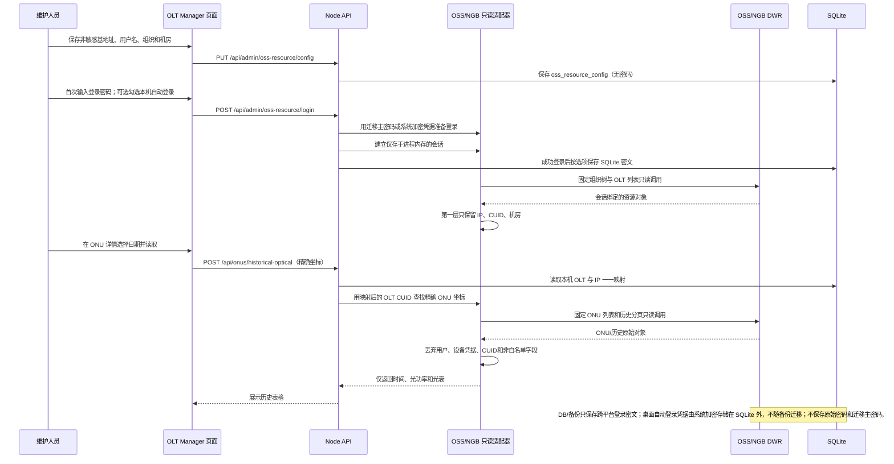
```mermaid
sequenceDiagram
  participant User as 维护人员
  participant Browser as OLT Manager 页面
  participant API as Node API
  participant Session as OSS/NGB 只读适配器
  participant OSS as OSS/NGB DWR
  participant DB as SQLite

  User->>Browser: 保存非敏感基地址、用户名、组织和机房
  Browser->>API: PUT /api/admin/oss-resource/config
  API->>DB: 保存 oss_resource_config（无密码）
  User->>Browser: 首次输入登录密码；可选勾选本机自动登录
  Browser->>API: POST /api/admin/oss-resource/login
  API->>Session: 用迁移主密码或系统加密凭据准备登录
  API->>Session: 建立仅存于进程内存的会话
  API->>DB: 成功登录后按选项保存 SQLite 密文
  Session->>OSS: 固定组织树与 OLT 列表只读调用
  OSS-->>Session: 会话绑定的资源对象
  Session->>Session: 第一层只保留 IP、CUID、机房
  User->>Browser: 在 ONU 详情选择日期并读取
  Browser->>API: POST /api/onus/historical-optical（精确坐标）
  API->>DB: 读取本机 OLT 与 IP 一一映射
  API->>Session: 用映射后的 OLT CUID 查找精确 ONU 坐标
  Session->>OSS: 固定 ONU 列表和历史分页只读调用
  OSS-->>Session: ONU/历史原始对象
  Session->>Session: 丢弃用户、设备凭据、CUID和非白名单字段
  Session-->>API: 仅返回时间、光功率和光衰
  API-->>Browser: 展示历史表格
  Note over DB,OSS: DB/备份只保存跨平台登录密文；桌面自动登录凭据由系统加密存储在 SQLite 外，不随备份迁移；不保存原始密码和迁移主密码，会话/CUID仍只在内存，不刷新光功率，不访问 OLT 写接口
```

桌面版勾选本机自动登录后，服务重启会使用操作系统加密凭据后台建立会话；纯 Web/Node 环境或跨设备迁移仍由用户输入迁移主密码解密 SQLite 密文。历史查询只能在同一已授权会话中使用固定 OLT CUID/ONU CUID 和固定模板读取，并先投影再返回。当前切片不提供 OLT 列表管理界面、不自动创建 IP 映射、不保存历史明细，也不接入定时任务；验证码、多登录部门选择和会话续期仍按失败关闭处理。

## GitHub 自动发行流程

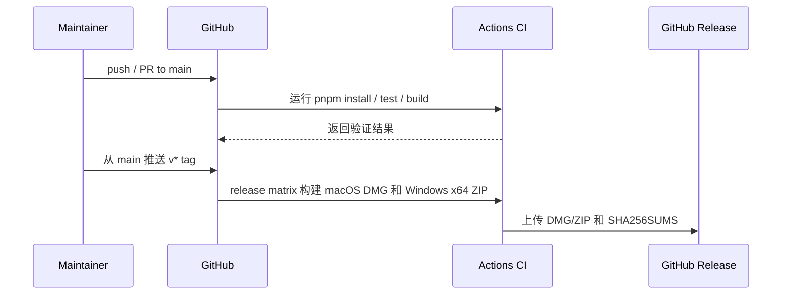
```mermaid
sequenceDiagram
  participant Maintainer as Maintainer
  participant GitHub as GitHub
  participant CI as Actions CI
  participant Release as GitHub Release

  Maintainer->>GitHub: push / PR to main
  GitHub->>CI: 运行 pnpm install / test / build
  CI-->>GitHub: 返回验证结果
  Maintainer->>GitHub: 从 main 推送 v* tag
  GitHub->>CI: release matrix 构建 macOS DMG 和 Windows x64 ZIP
  CI->>Release: 上传 DMG/ZIP 和 SHA256SUMS
```

GitHub Actions 只负责产出桌面发行包；Windows 7 x64 兼容性仍需要真实 Win7 或虚拟机手工验收。
