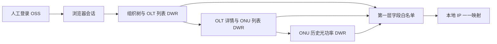

# 网管二期只读验证与本地映射总结

## 范围与结论

本轮工作分为两条彼此独立的路径：一条继续完善 OLT Manager 本机界面与 NMSE-PON 定时同步；另一条先验证 OSS/NGB“网管二期”资源发现、ONU 列表和历史光功率的只读接口，再将历史光功率首个固定只读切片接入 OLT Manager。

已确认 OSS/NGB 页面使用会话绑定的 DWR 调用，不是已确认的公开 REST API。OLT Manager 现已提供内置非敏感配置、内存登录会话和 ONU 详情历史光功率查询；真实映射、现场设备、用户资料和会话材料只保存在本机运行数据或内存，不进入可提交文档。

## 本轮产品调整

- 飞书页面和菜单统一使用“飞书机器人”名称；飞书 APP ID/APP SECRET 与大模型配置分开保存。
- 移除飞书页面的运行边界、查询范围、语言 provider 说明和 CC Switch 导入入口；大模型密钥标签简化为“API KEY”。
- 删除“数据采集记录”菜单和首页“警告通知”卡片，修正首页运行时间显示。
- 在“专线项目管理”和“备份还原”之间新增“定时任务”：可选择执行日期、时间和目标 OLT，通过既有固定 NMSE-PON 只读流程更新本地用户快照。
- 定时任务支持按 1-365 天重复、取消待执行任务，以及删除非执行中的任务记录。

以上界面与定时同步仍遵守原有边界：只读 NMSE-PON、只写本地 SQLite，不下发或修改 OLT 配置。

## OSS/NGB 已验证流程

已验证的页面路径为：配置管理中的设备资源列表 → 单台 OLT 详情 → 详细参数中的 ONU 列表 → 单条 ONU 的历史光功率。对应的只读调用包括：

- 组织树和详情菜单：`TreePanelAction.loadData`。
- OLT/ONU/历史列表元数据：`GridViewAction.getGridMeta`。
- 分页与数据：`GridViewAction.getGridPageInfo`、`GridViewAction.getGridData`。
- 历史光功率字典和权限：`CmpTplDwrAction.getGridDict`、`AuthorityDwrAction.getFuncAuth`。
- OLT 详情入口：`GET /ngb/ResDevAction/config.do`。
- ONU 历史入口：`GET /ngb/core/cmp_ext/mt/MvQueryGridPanel.jsp`。

完整的脱敏参数合同、模板名、查询对象和字段白名单见 [`docs/design/oss-resource-api.md`](design/oss-resource-api.md)。

## 数据投影与安全边界

- OLT 资源只允许投影支撑网 IP、属地 IP、脱敏别名、厂商、型号、机房和 ONU 数量等必要字段。
- ONU 列表只允许按业务需要投影标识、接口坐标、运行状态、光功率和设备信息；姓名、电话、地址、宽带账号等只能进入受保护的本地用户数据域。
- 历史光功率对普通诊断只允许投影采集时间、ONU/OLT 侧光功率和光衰。
- SNMP community、Telnet 字段、Cookie、token、`JSESSIONID`、DWR `scriptSessionId`、内部组织标识和原始响应不得落盘、写日志、进入语言模型请求或飞书回复。
- “历史光功率”是读取已有历史数据，不得隐式调用单 ONU 光功率刷新或 PON 口全量刷新。
- 正式适配器只能暴露固定 method 白名单和字段级投影，不能实现任意 DWR 代理。

## 本地 IP 映射

`resource_olt_ip_mappings` 用于关联网管二期支撑网 IP 与现有 `olts.host` 管理 IP：

- `resource_ip` 为主键，`olt_ip` 唯一，形成严格一一对应。
- 写入前校验 IPv4 格式、重复关系和目标 `olts.host` 是否存在。
- `source` 与 `synced_at` 记录来源和更新时间。
- 映射不会修改 `olts.host`，不会保存 OSS 会话或原始资源对象，也不会自动启用 OLT。
- 尚未取得 SNMP 或登录资料的设备可以作为停用 OLT 留在本地台账；凭据为空时不得尝试连接。

当前历史光功率切片已通过本地 HTTP API 和 ONU 详情页使用该映射；仍没有自动发现或写入映射，也没有把 OSS/NGB 读取接到定时任务或自动同步。

## 验证

- `node --check src/db.mjs` 通过。
- `pnpm test` 通过，共 201 项测试。
- `pnpm build` 通过；本机页面、`/api/bootstrap` 和 OSS 非敏感配置接口冒烟检查均返回 HTTP 200。
- Web 与桌面运行库均执行 SQLite `integrity_check`，结果为 `ok`。
- `git diff --check` 通过。
- 现场数据库修改前已分别生成本地备份；准确文件名记录在不提交的 `DEVELOPMENT_STATE.md`。

## 尚未完成

- OSS 是否存在正式、稳定、可脱离浏览器会话的 API 尚未确认。
- DWR 会话续期、验证码、单点登录失效和权限变化的恢复策略尚未实现。
- 不同 OSS/NGB 版本的合同兼容检测尚未实现；当前适配器只覆盖已验证的三项只读 DWR method。
- 本地 IP 映射尚未提供管理界面或 HTTP API，也未接入自动资源发现。
- 未配置 SNMP 的设备继续保持停用；在补齐只读 profile 与凭据前不得启用。
- 现场中可能存在已确认但尚未登记到 OSS 的设备，来源必须明确标记，不能伪装为 OSS 自动发现结果。

## 2026-08-14 登录失败修复闭环与可复用经验

### 现象与调查路径

用户在本地 Web 页面点击“保存并登录”后，网管二期组织树读取失败，页面显示 HTTP 200 的 DWR `NullPointerException`。调查没有把 HTTP 200 当作业务成功，而是按以下顺序建立证据：

1. 在 OLT Manager 页面复现错误并保留失败阶段、批次、响应类型和长度等脱敏诊断信息。
2. 用真实 OSS/NGB 页面进行只读导航，记录根节点、组织树展开和机房 OLT 列表的请求顺序与字段形状。
3. 对比项目原生 HTTP 传输与真实浏览器传输，确认框架页初始化结果不同。
4. 先修复最小请求合同，再用合成回归测试和真实 Web 页面分别验收。

### 根因与修复

- 旧 NGB 对缺少 `User-Agent` 的原生请求返回不完整的框架上下文，后续 DWR 根节点调用因此出现空指针。所有 OSS/NGB 原生请求现在携带固定的 OLT Manager 只读客户端标识。
- 真实页面的组织树根节点只发送模板参数；展开子节点时只发送 12 个固定字段。适配器现在对服务端节点做白名单投影，避免把通用字段、递归对象和额外业务数据重新序列化给旧 DWR 转换器。
- 真实机房列表只把机房范围放入基础参数，并在 `queryParams.DOMAIN` 复用 `RELATED_ROOM_CUID`、别名 `T0` 的过滤对象。适配器已按该合同构造机房查询，并保留无机房时的组织范围分支。
- DWR 会话语义以真实页面为准：`httpSessionId` 保持为空，JSESSIONID 只通过进程内 Cookie 发送；页面脚本会话种子只用于当前内存会话。

### 最终验收

- 用户明确授权后，用一次性内存密码在真实本地页面完成“保存并登录”；页面提示登录成功并发现 6 台目标机房 OLT。
- 本地配置接口确认会话状态为 `loggedIn=true`，密码输入框已清空；未保存密码、Cookie、token、DWR 会话、内部 CUID 或原始响应。
- OSS 专项测试 9/9、全量测试 206/206、构建和 `git diff --check` 通过。
- 本次只读取 OSS/NGB 组织树和 OLT 列表，未执行 OLT 采集刷新、配置、删除、认证、重启或任何写操作。

### 可复用经验

- 旧 Java/DWR 系统中，HTTP 200 只代表 HTTP 层成功，必须同时判断 DWR 返回体是否为异常响应。
- 浏览器成功请求的字段形状比猜测批次号、追加权限接口或增加 URL 回退更有价值；应先建立最小真实合同，再实现固定投影。
- 对网管系统的登录验收应分层确认：框架页完整、DWR 会话可用、组织树可展开、机房列表可读、页面状态和后端状态一致。
- 诊断输出只保留阶段、状态、长度、字段名和计数；任何密码、Cookie、令牌、内部标识和原始响应都不进入文档或日志。

## 2026-08-15 网管二期配置与备份还原闭环

- 已确认网管二期的非敏感配置已经落在 SQLite 的 `oss_resource_config` 单行表中，保存认证地址、NGB 地址、用户名、组织名称和机房名称。
- 完整项目备份采用 SQLite 全库快照，因此同时覆盖 `oss_resource_config` 和 `resource_olt_ip_mappings`；还原流程保留这些表的数据，并在完成后清除运行时网管二期会话。
- 新增回归验收：保存一组网管二期配置，导出完整备份，写入另一组配置，再还原备份，确认原配置完整恢复；同时确认密码字段不会被保存、返回或写入备份。
- 备份页提示已明确区分“网管二期非敏感配置和登录密码加密密文可备份”和“原始登录密码、迁移主密码不备份”。
- 新增 `oss_resource_credential` 单行密文表：首次登录提供网管二期密码和迁移主密码，成功后以 scrypt + AES-256-GCM 保存；还原到 Win7 后可用同一迁移主密码复用，主密码只在解锁期间由用户输入。
- 这项变更没有扩大设备访问范围，备份和还原只操作本机 SQLite/Feishu 本地状态，不连接、不写入 OLT。

## 2026-08-15 对话流程与修复经验总结

### 从故障到验收

1. 用户在本地 Web 页面点击“保存并登录”，页面显示 DWR `TreePanelAction.loadData` 的 Java 空指针；先记录阶段、批次、状态码和响应长度等脱敏证据。
2. 不把 HTTP 200 当作业务成功，使用真实 OSS/NGB 成功页面做只读请求基线，逐项比较框架页、设备配置页、组织树、机房 OLT 列表和 DWR 会话字段。
3. 固定最小只读合同后，补充客户端单元测试、API fixture 测试、错误阶段测试，再通过本地页面验收登录状态和发现数量。
4. 登录成功后继续验证用户精确坐标、历史光功率读取、非敏感配置保存、备份还原和密码输入框清理；整个过程未执行 OLT 采集刷新、配置、删除、认证、重启或写操作。

### 根因与经验

- 旧 Java/DWR 系统返回 HTTP 200 不代表业务成功，必须解析 DWR 异常体。
- 原生 HTTP 请求要复用真实页面必要的客户端标识；缺少 `User-Agent` 会使旧 NGB 返回不完整框架上下文。
- 组织树不能猜测参数或拼接搜索请求；根节点、子节点字段投影和请求顺序必须与页面合同一致。
- DWR 的 `httpSessionId`、JSESSIONID、`scriptSessionId`、页面版本和 `batchId` 都属于会话材料；只在内存中按页面顺序建立，不能写入数据库或日志。
- 机房筛选应使用页面实际的 `RELATED_ROOM_CUID`/`DOMAIN` 过滤对象；不要为了“看起来更严格”添加未经页面验证的条件。
- 先建立固定白名单和字段投影，再扩展读取范围；不能把内部 DWR 做成任意代理。

### 两套用户信息的边界

资源系统（NMSE-PON）保存本地用户快照，主字段是 `OLT IP + ONU 索引`、LOID、用户名、电话、装机地址、PON、设备类型和同步时间，适合用户档案和业务关系查询。

网管二期（OSS/NGB）是在线资源页面，原始 ONU 响应还可能包含内部 CUID、SN/MAC、设备状态、设备型号和光功率字段；当前 OLT Manager 只保留精确坐标定位所需的内部信息，并返回历史光功率时间、RX、TX、OLT RX 和光衰，不把网管二期用户明细写入本地快照。

因此，两套系统不能仅按姓名或电话号码直接合并。可复核的关联顺序应是：本机 OLT 管理 IP → 已确认的网管二期支撑网 IP 映射 → 完整 ONU 坐标 → LOID/MAC 等辅助字段。网管二期未登录时，只能比较字段模型和本地资源快照统计，不能声称已经完成逐条差异比对。

### 跨平台密码迁移经验

- 非敏感配置进入 `oss_resource_config`；登录密文单独进入 `oss_resource_credential`。
- 首次成功登录或更新密码时，同时输入登录密码和用户自选迁移主密码；密码使用 scrypt 派生密钥和 AES-256-GCM 加密后才写入 SQLite。
- 备份还原保留加密密文和 IP 映射；迁移主密码不保存，Win7 上必须由用户再次输入。
- 错误迁移主密码拒绝解密；登录接口、配置接口、审计和测试输出不返回原始密码、主密码、密文、Cookie 或 token。

### 最终验证

- 聚焦 OSS 加密/登录 API：加密往返、错误主密码、仅用主密码复用登录、备份还原后密文状态均通过。
- 全量 `pnpm test`：208/208 通过。
- `pnpm build`、`node --check src/oss-credential-crypto.mjs`、`node --check src/db.mjs`、`node --check src/server.mjs` 和 `git diff --check` 通过。
- 本地 Web 程序重新监听 `http://127.0.0.1:8787/`；现场数据库未因本轮测试写入真实网管二期密码，首次持久化仍需用户在页面输入迁移主密码后执行“保存并登录”。
